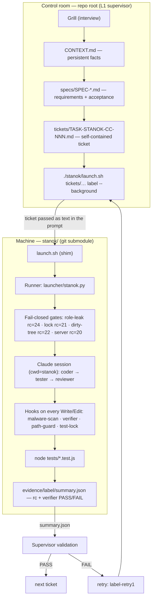

# Pet project: autonomous code via a Claude Code machine

Two-level template for starting a new project "from interview to code":

- **Root of this repo** — the control room (L1 supervisor): interview (grill) →
  spec → tickets → machine launch → validation. Role — `CLAUDE.supervisor.md`
  (injected by `P0-launch.sh` so it does NOT leak into the machine as a role).
- **`stanok/`** — git submodule: a Claude Code machine on a local model.
  Autonomous TDD cycle under deterministic hooks, tests run with a real `node`,
  result — `stanok/evidence/<label>/summary.json`.

Tickets and specs live here, in the root; the machine does not see them — each ticket
is self-contained and passed to it as text in the prompt.

## How it works

Two separate git repos: the **root** is the control room (L1 supervisor),
`stanok/` is a git submodule — the machine. The supervisor never writes code;
it only produces tickets and launches the machine, which returns a typed
`summary.json` for validation.



## Structure

```
./
├── CLAUDE.supervisor.md   # L1 role (grill → spec → ticket → run)
├── CONTEXT.md             # persistent project facts (filled in by the grill)
├── P0-launch.sh           # interactive entry: claude + local model + role
├── specs/                 # specs and STATUS.md (created by the grill)
├── tickets/               # TASK-STANOK-CC-NNN.md (created by the grill)
└── stanok/                # git submodule — the machine (self-contained, see its README)
```

## Quick start

1. **Machine:** `cd stanok && ./setup.sh` → `.venv` + `claude-agent-sdk`.
   Check: `DOCTOR_EXPECT_NO_CLOUD=1 bash hooks/doctor.sh` → 14 ok, 0 fail.
2. **Server:** start a local llama-server (Anthropic-compatible), address —
   `STANOK_SERVER_URL` (default `http://127.0.0.1:8080`).
3. **Control room:** `./P0-launch.sh` — opens an interactive supervisor session
   on the local model. Start with the grill: interview → CONTEXT.md → specs → tickets.
4. **Ticket run:**
   `./stanok/launch.sh tickets/TASK-STANOK-CC-NNN.md <label> --background`
   Observe: `./stanok/launch.sh status <label>`.

## Role isolation (important)

Claude Code auto-loads `CLAUDE.md` from cwd AND from parent directories. If a `CLAUDE.md`
lies in the project root, the machine (cwd=`stanok/`) will pick it up as its role. Therefore:
the control-room role lives in `CLAUDE.supervisor.md` and is injected explicitly via
`--append-system-prompt-file`. **Do not create a `CLAUDE.md` in the root.**

## Publishing to GitLab

This repo and `stanok/` are TWO separate git repos.

1. Create an empty repo on GitLab for the machine (e.g. `stanok-skeleton`) and push:
   ```
   cd stanok && git remote add origin <gitlab-url-stanok> && git push -u origin main
   ```
2. In the root repo update the submodule URL:
   ```
   git config -f .gitmodules submodule.stanok.url <gitlab-url-stanok>
   git submodule sync
   ```
3. Push the root repo (the parent). After cloning in a new place:
   ```
   git clone --recurse-submodules <gitlab-url-parent>
   cd stanok && ./setup.sh
   ```

## Configuration (env, see the machine README)

`STANOK_SERVER_URL`, `STANOK_MODEL`, `STANOK_PROXY`, `STANOK_CLAUDE_BIN`,
`STANOK_PY` — all overridable from the environment.
